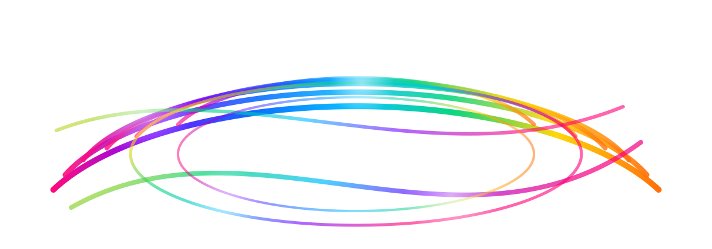

# The ARC Book
by [Jos De Roo](https://josd.github.io/)

  

[ARC](https://eyereasoner.github.io/eye/arc/)—short for Answer • Reason • Check—takes a question-first view of computation. Start with Data, add Logic, and pose a precise Question; the result is a self-contained program that does three things every time it runs: it produces an answer, it explains why that answer follows, and it checks itself. The method behind ARC is deliberately simple to remember—P3: Prompt → Program → Proof. In practice, the “proof” is not a theorem in a textbook sense but an obligation the program carries with it: Proof = Reason Why + Check. The aim is to make every run auditable, reproducible, and friendly to continuous integration.

The pages that follow present ARC in small, runnable pieces. Each case is compact—often “JS-only”—and renders the ARC triad in place: an Answer, the Reason Why, and a Check that can fail loudly when something is off. The subjects range widely, from mathematics and formal logic to routing problems, clinical policy, and classic puzzles. A Sudoku or a Pythagorean-theorem demonstration, for instance, appears not as a black-box result but as a traceable procedure with its own built-in harness for verification.

ARC stands alongside the EYE reasoning stack, with its roots in the Semantic Web: Notation3, explicit rules, and symbolic inference via forward and backward chaining along Euler paths. That lineage gives ARC a useful counterbalance to generative methods. Let the model help draft a procedure; keep the logic explicit and inspectable; and verify the outcome every time the code runs. In that way, synthesis and proof travel together.

If you are reading this for the first time, the best way in is straightforward: pick a case, run it, read the Reason Why, and then study the Check. That rhythm—the ARC triad—is the point.

### Examples and Test Cases
- [A₂ (Ackermann via hyper-operations)](https://eyereasoner.github.io/eye/arc/etc/ackermann.html) — Compute A₂ with exact hyper-ops; print small, expand huge safely.
- [Apollonian gasket](https://eyereasoner.github.io/eye/arc/etc/apollonian_gasket.html) — Exact tangent-circle packing via Descartes’ theorem and complex centers.
- [🩺 AuroraCare](https://eyereasoner.github.io/eye/arc/etc/auroracare.html) — Purpose-based medical data exchange.
- [Bike Trip Planning](https://eyereasoner.github.io/eye/arc/etc/bike_trip.html) — Route priorities from hazards, preferences, and declarative JSON rules.
- [BMI](https://eyereasoner.github.io/eye/arc/etc/bmi.html) — Compute BMI categories with explainable thresholds and sanity checks.
- [Building Performance](https://eyereasoner.github.io/eye/arc/etc/building_performance.html) — Reason about energy/comfort metrics and verify rule-based outcomes.
- [Clinical Care Planning](https://eyereasoner.github.io/eye/arc/etc/clinical_care.html) — Derive care plans from observations, guidelines, and policy constraints.
- [Collatz (3n+1)](https://eyereasoner.github.io/eye/arc/etc/collatz.html) — Generate trajectories and check invariants for the Collatz map.
- [Combinatorics](https://eyereasoner.github.io/eye/arc/etc/combinatorics.html) — Count, choose, and permute with proofs of identities where feasible.
- [Complex identities — explanatory proofs](https://eyereasoner.github.io/eye/arc/etc/complex.html) — Symbolic steps for complex-number equalities with auditable reasoning.
- [Control System](https://eyereasoner.github.io/eye/arc/etc/control_system.html) — Model simple feedback loops and verify stability/response conditions.
- [Cryptarithm](https://eyereasoner.github.io/eye/arc/etc/cryptarithm.html) — Solve letter-to-digit puzzles with constraint checks on carry/uniqueness.
- [📱 Delfour Insight Economy](https://eyereasoner.github.io/eye/arc/etc/delfour.html) — Derives a neutral insight, applies an ODRL policy, and suggests a healthier alternative.
- [Descartes’ circle theorem](https://eyereasoner.github.io/eye/arc/etc/descartes_circles.html) — Compute the fourth tangent circle from three using curvature relations.
- [Easter (Computus)](https://eyereasoner.github.io/eye/arc/etc/easter.html) — Derive Easter dates from calendrical rules with verifiable steps.
- [🚚 Eco-Route](https://eyereasoner.github.io/eye/arc/etc/eco_route.html) — Pick lower-emission routes by fusing traffic, grade, and policy goals.
- [Euler’s characteristic](https://eyereasoner.github.io/eye/arc/etc/euler_characteristic.html) — Compute χ = V−E+F for meshes; sanity-check against topology rules.
- [Family logic](https://eyereasoner.github.io/eye/arc/etc/family.html) — Infer kinship from base relations (parent, spouse) with consistency checks.
- [Fibonacci golden spiral](https://eyereasoner.github.io/eye/arc/etc/fibonacci_golden_spiral.html) — Draw the spiral from Fibonacci rectangles and verify ratios.
- [Fibonacci via Fast Doubling](https://eyereasoner.github.io/eye/arc/etc/fibonacci.html) — Compute big Fₙ with fast-doubling recurrences and proof-style checks.
- [Ford circles](https://eyereasoner.github.io/eye/arc/etc/ford_circles.html) — Place circles at rationals; verify tangency and Farey-sequence links.
- [🧭 GPS Clinical Bench](https://eyereasoner.github.io/eye/arc/etc/gps_clinical_bench.html) — Benchmark clinical decisions with transparent rules and audit trails.
- [Graph — French cities](https://eyereasoner.github.io/eye/arc/etc/graph_french.html) — Shortest paths and connectivity over a city graph with proofs.
- [Grass seed — molecular germination](https://eyereasoner.github.io/eye/arc/etc/grass_molecular.html) — Model germination states and transitions with rule checks.
- [Group Theory](https://eyereasoner.github.io/eye/arc/etc/group_theory.html) — Verify closure, identity, inverses, and associativity on examples.
- [Health Information Processing](https://eyereasoner.github.io/eye/arc/etc/health_info.html) — Transform clinical payloads with typed rules and validation.
- [Infinite Game of Insight Economy](https://eyereasoner.github.io/eye/arc/etc/infinite_game_insight_economy.html) — Score derivation, minimization, activation, equilibrium, and copy-resistance; includes test checks.
- [Kakuro (Cross Sums)](https://eyereasoner.github.io/eye/arc/etc/kakuro.html) — Fill grid sums with unique digits using constraint propagation.
- [KenKen](https://eyereasoner.github.io/eye/arc/etc/kenken.html) — Latin-square + cage arithmetic solved with explainable deductions.
- [Lee](https://eyereasoner.github.io/eye/arc/etc/lee.html) — Maze routing with Lee’s algorithm; trace optimal wavefront paths.
- [The Library & the Path](https://eyereasoner.github.io/eye/arc/etc/library_and_path.html) — Toggle “laws,” search a minimal path to a target observation set, then verify with independent checks.
- [LLDM](https://eyereasoner.github.io/eye/arc/etc/lldm.html) — Leg Length Discrepancy Measurement: estimate leg-length discrepancy from four landmarks with an ARC trace.
- [Mathematics — the WHAT & the WHY](https://eyereasoner.github.io/eye/arc/etc/math_what_why.html) — Pair results with reasons: each computation carries its proof sketch.
- [Matrix basics](https://eyereasoner.github.io/eye/arc/etc/matrix.html) — Do matrix ops (add/mul/inv) with dimension and property checks.
- [N-Queens](https://eyereasoner.github.io/eye/arc/etc/n_queens.html) — Place N queens without attacks; verify constraints per row/diag.
- [Nonogram (Picross)](https://eyereasoner.github.io/eye/arc/etc/nonogram.html) — Fill grid cells to match run hints using logical deductions.
- [Pentagon & pentagram — golden ratio](https://eyereasoner.github.io/eye/arc/etc/pentagon_pentagram.html) — Construct φ-relations in pentagons and star polygons with proofs.
- [π (Chudnovsky)](https://eyereasoner.github.io/eye/arc/etc/pi.html) — High-precision π via Chudnovsky series with error-bound checks.
- [Pick’s Theorem](https://eyereasoner.github.io/eye/arc/etc/picks_theorem.html) — Area = I + B/2 − 1 for lattice polygons; verify interior/boundary counts.
- [Polynomial roots (Durand–Kerner)](https://eyereasoner.github.io/eye/arc/etc/polynomial.html) — Find all roots simultaneously; prove convergence on typical cases.
- [Primes](https://eyereasoner.github.io/eye/arc/etc/prime.html) — Generate/test primes; log certs (e.g., trial factors or proofs) as checks.
- [Pythagorean Theorem](https://eyereasoner.github.io/eye/arc/etc/pythagorean_theorem.html) — Compute legs/hypotenuse and confirm with algebraic or area proofs.
- [REST-path](https://eyereasoner.github.io/eye/arc/etc/rest_path.html) — Explain link-following over REST resources; verify pre/post conditions.
- [Roots of Unity](https://eyereasoner.github.io/eye/arc/etc/roots_of_unity.html) — Place complex n-th roots on the unit circle; check equal spacing and sums/products.
- [Skyscrapers](https://eyereasoner.github.io/eye/arc/etc/skyscrapers.html) — Deduce building heights from sightlines with constraint logic.
- [🏛️ Socrates](https://eyereasoner.github.io/eye/arc/etc/socrates.html) — Classic syllogisms with explicit inference traces.
- [Square tiled by 17 right triangles](https://eyereasoner.github.io/eye/arc/etc/square_triangles.html) — Dissect a square into 17 right triangles; verify tiling constraints.
- [Sudoku](https://eyereasoner.github.io/eye/arc/etc/sudoku.html) — Explain each step of solving a 9×9 with row/col/box checks.
- [Turing Machine](https://eyereasoner.github.io/eye/arc/etc/turing.html) — Run tapes with explicit transitions; verify halting and tape contents.
- [Wind-Turbine Maintenance](https://eyereasoner.github.io/eye/arc/etc/wind_turbines.html) — Plan maintenance from telemetry and policies with auditable outcomes.

