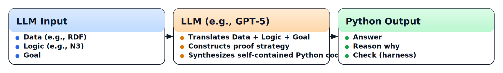

# Insights

Insights are **deep, actionable understandings** derived from analyzing data, observations, or experiences that reveal hidden patterns, motivations, or relationships. Unlike raw facts or surface-level information, insights uncover the **“why”** behind behaviors, trends, or outcomes, enabling better decision-making and strategy. They often come from connecting disparate pieces of information in a meaningful way; here, we do that explicitly by combining **Data** (e.g., RDF), **Logic** (e.g., N3), and a **Goal**, which an **LLM** translates into a self-contained Python program that produces an **Answer**, explains the **Reason why**, and runs an independent **Check (harness)**. In essence, insights transform data and knowledge into **clarity and direction**.

---

## Conceptual Overview



The approach is to use a **Large Language Model (LLM)**—e.g., *GPT-5 Thinking*—to translate **Data/Logic/Goal** into a **self-contained Python program** that:

1. computes an **Answer**,
2. explains the **Reason why**, and
3. runs an independent **Check (harness)** to verify itself.

This bridges symbolic reasoning with generative models by treating the LLM as a **meta-compiler for executable reasoning** rather than just a text generator.

## Features

* **Executable reasoning:** LLM emits runnable Python, not just a narrative.
* **Three artifacts by design:** `Answer`, `Reason why`, `Check (harness)`.
* **Separation of concerns:** declarative **Data/Logic/Goal** → imperative program.
* **Auditable & diffable:** code, not hidden activations; easy to review and rerun.
* **Extensible:** swap datasets, rule sets, goals, or models.

---

## Quickstart

Run the [eye insights examples and test cases](https://github.com/eyereasoner/eye/tree/master/insights/cases) to get the [answer, reason why and check (harness)](https://github.com/eyereasoner/eye/tree/master/insights/cases/output)
   ```bash
   ./test
   ```

