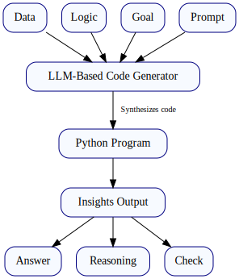

# A Guide to EYE Teaching ARC (Answer, Reason, and Check)

## The Challenge: From Raw Data to Trusted Insight

In an era of powerful AI, the path from raw **Data** to trusted, actionable insight remains a significant challenge. How can we be sure an answer is correct? How can we audit the reasoning behind it? And how can we automate this process reliably?

This is a challenge of instruction. It's about teaching a Large Language Model (LLM) how to perform a specific, rigorous task. **EYE Teaching** offers a practical and robust solution for this. It is a method for transforming raw inputs—**Data**, **Logic**, a specific **Goal**—into a single, **Self-contained Python program**. The LLM, acting as a student programmer, learns from these inputs to generate a program that is fully autonomous.

Most importantly, this program is required to deliver three key outputs, creating a "triad of trust":

1.  The final **Answer**.
2.  A clear explanation of the **Reason Why**.
3.  An independent **Check (harness)** that validates the result, guarding against errors and LLM hallucinations.

A [public repository](https://github.com/eyereasoner/eye/tree/master/teaching) provides a comprehensive suite of examples and a one-command runner to reproduce this "answer, reason, check" triad for every case.

-----

## What EYE Teaching Is: Goal-Directed Program Synthesis

At its core, EYE Teaching is a pattern for **goal-directed program synthesis**. Think of it as teaching a brilliant, lightning-fast programmer a new skill by providing a complete lesson plan. You give it a task and all the materials needed, and you expect it to produce a specific, well-structured deliverable.

The process is simple yet powerful:

1.  You formulate a **Prompt** that acts as the core instruction, telling the LLM what kind of program to write.
2.  Within this instruction, you declare a precise **Goal** (e.g., "Is this transaction compliant?" or "Find all ancestors of person X.").
3.  You provide the necessary **Data** (the facts) and the **Logic** (the rules) that govern the domain.
4.  You instruct the LLM to write a **Self-contained Python Program** that automatically ingests these inputs and produces the complete "answer, reason, check" output.

The key deliverable is a **self-contained and self-verifying program**. It's not just a code snippet to be integrated into a larger system; it's a trustworthy and auditable artifact you can execute in a CI/CD pipeline, share with auditors, and deploy with confidence.

-----

## What Makes It Different: A Hybrid Approach

EYE Teaching stands out by combining the creative flexibility of generative AI with the formal rigor of symbolic systems. This hybrid approach offers several unique advantages.

  * **Self-Contained, Self-Checking Outputs:** The LLM's primary output is a single, runnable Python program with its own built-in test harness (**Check**). Every execution produces both a result (**Answer**) and an independent verification. This builds immense trust and reliability, moving beyond the "black box" paradigm.

  * **A Bridge Between Symbolic and Generative AI:** It uses the LLM for what it does best—understanding the intent from the **Prompt** and synthesizing code structure—while relying on formal **Logic** for explainability (**Reason Why**). This overcomes the brittleness of pure symbolic systems and the opacity of pure neural networks.

  * **Explainability by Design:** The generated program is explicitly required to explain its reasoning. This aligns with the core philosophy of the EYE reasoner [^1], which provides transparent logical derivations instead of just answers. You don't just know *what* the answer is; you know *why* it's the answer.

  * **Goal-First Engineering:** By starting with a clear business or research **Goal**, the LLM learns a concrete, repeatable procedure to achieve it. The resulting program becomes a durable asset—perfect for automation, compliance checks, and reproducible research.

-----

## Architecture at a Glance

The conceptual pipeline is straightforward. The inputs (**Data**, **Logic**, and **Goal**) are fed into an LLM, which is taught to act as a synthesizer. Its sole job is to produce the final, executable program—the only artifact needed to generate actionable insight (**Answer**, **Reason**, and **Check**).

This architecture is built on two principles: (1) runtime **verification is mandatory** (the **Check**), and (2) the primary output is a **portable program** that is easy to manage, version, and execute anywhere.

-----

## Advanced Pattern: Mixed Computation

For performance-critical applications, EYE Teaching supports an advanced pattern that separates stable **Logic** from dynamic **Data**. This **"mixed-computation"** approach, inspired by foundational computer science principles [^2], teaches the LLM a more sophisticated compilation strategy. It learns to treat your stable policies (the "how") as static code and your live inputs (the "what") as dynamic data.

The LLM-guided synthesis step acts as a "specializer," converting the declarative **Logic** into a compact, highly efficient **Driver** function in Python.

  * **At Runtime:** This specialized Driver is extremely fast. It consumes only the dynamic facts (e.g., a new user transaction), applies the pre-compiled logic, and emits the standard **Answer**, **Reason Why**, and **Check**.
  * **Governance:** The core logic remains in a human-readable, declarative format. To update a policy, you simply update the logic and re-run the synthesis step to generate a new Driver—no complex algorithmic rewrite is needed.
  * **Benefits:** This approach preserves the core "answer, reason, check" contract while dramatically improving **speed, determinism, and auditability**. Your logic stays declarative and clear, while your execution becomes small, fast, and predictable.

-----

## Getting Started: A Typical Workflow

Adopting EYE Teaching is a straightforward, iterative process:

1.  **Define the Goal:** Start by clearly stating the decision, conclusion, or question you need to answer.
2.  **Assemble Inputs:** Gather the relevant **Data** files, the **Logic** that defines your operational constraints, and craft a **Prompt** that clearly explains the task to the LLM.
3.  **Synthesize the Program:** Use the **Prompt** to teach the LLM how to generate the single **Self-contained Python Program** that produces the **Answer**, **Reason Why**, and **Check (harness)**.
4.  **Execute and Validate:** Run the generated program. Confirm that the outputs are correct and that the self-verification harness passes. The repository's `./test` command automates this for all examples.
5.  **Iterate and Harden:** As your data and logic evolve, you can refine your **Prompt** or inputs and simply re-run the synthesis step to create an updated, validated artifact.

-----

## Why This Matters: The Practical Benefits

  * **Trust and Auditability:** The "answer, reason, check" triad provides a robust framework for building trust in AI-driven systems. Every result is verifiable and explainable, making it suitable for regulatory and compliance-driven environments.
  * **Extreme Automation:** By producing a self-contained executable, EYE Teaching is a perfect fit for modern DevOps and MLOps pipelines. The generated programs can be versioned in Git, tested in CI, and deployed anywhere.
  * **Lower Maintenance Overhead:** Because the system's intelligence is maintained as declarative logic, you don't need to refactor complex code to change business policies. You simply update the logic and regenerate the program.
  * **Democratized Expertise:** This pattern allows subject matter experts to define operational logic in a high-level format, while the LLM handles the complex task of translating that logic into efficient, verifiable code.

[^1]:
    R. Verborgh and J. De Roo. Drawing Conclusions from Linked Data on the Web: The EYE Reasoner. IEEE Software, vol. 32, no. 3, pp. 23-27, May-June 2015, doi: 10.1109/MS.2015.63.

[^2]:
    Ershov, A. P. (1982). Mixed Computation: Potential Applications and Problems for Study. Theoretical Computer Science, 18, 41–67.
